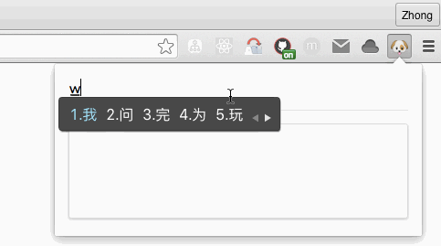

# Emoji-Zh
Query emoji with simple chinese in the chrome extension



## Installation

Download [.crx](https://github.com/2yuri/emoji-zh/releases/download/v0.0.1/emoji_zh_0.0.1.crx) and install.

## Prepare the ui framework

```bash
npm i semantic-ui
npm run build-ui
npm run clean-ui
```

## Development

1. Run ```npm install```
2. Run ```npm run dev ```
3. Point your browser to http://localhost:3000/app/index.html

## Deployment for chrome extension

1. Compile the bundle file, run ```npm run compile```
2. Build extension folder, run ```gulp```
3. Go to chrome://extensions/ load the __chrome_ctx__ folder.

## references:
1. https://developer.chrome.com/extensions/contentSecurityPolicy
2. http://ctheu.com/2015/12/29/webpack-hot-reloading-and-react-how/
